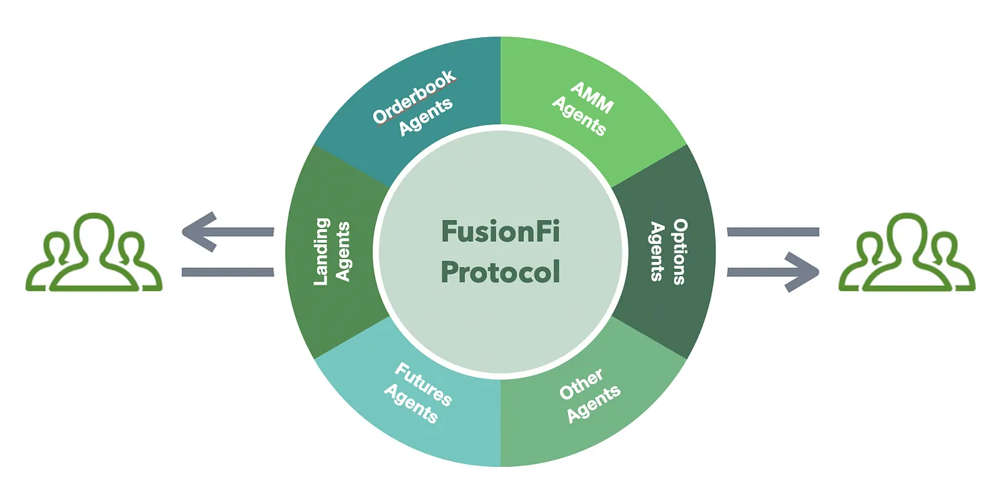

# FusionFi 协议 - 初稿

## 概述
在去中心化金融（DeFi）领域，FusionFi 为 AgentFi 生态提供了一种标准化的互操作性协议框架。
通过该协议，用户能够部署具有个性化金融功能的代理（Agent），自主执行资产管理、套利等操作。
FusionFi 的核心理念是在标准化的协议框架内，让 Agents 之间具备互操作性，使其能够在不同金融场景之间无缝协作，实现资本效率最大化。

## 基本概念

### AO
AO 是一部基于 Arweave 去中心化存储网络构建的超并行计算机。它采用模块化架构设计，可以通过无限数量的并行进程进行扩展，支持高效的数据存储和处理。AO 的设计目标是提供一个灵活且高效的计算平台，使得用户能够在去中心化环境中进行复杂的计算任务，同时确保数据的安全性和可访问性。关于 AO 网络的详细介绍请访问此处：https://cookbook_ao.arweave.dev/  

### Process
Process 是 AO 中的一个核心概念，指的是在计算环境中执行的独立任务或工作流。每个进程都是分散的、确定性的计算环境，根据预定义的逻辑与 AO 网络进行交互。它们的功能与智能合约类似，但提供更大的灵活性和对无限计算的访问。每个进程都维护一个持久的全息状态，作为消息日志存储在 Arweave 上。这些功能使 AO 进程能够充当可验证的自主代理(Agent)，能够在链上执行大规模计算并执行高级任务，而无需人工干预。

### Agent
Agent(代理) 是一个具有明确功能和目标的专用程序实体，Agent 可以执行单一任务，例如获取数据，也可以通过执行复杂的逻辑来自主操作，例如多步骤的工作流，条件决策以及与其他 Agent 的动态交互等。

### AgentFi
AgentFi 是一种基于 Agent 的金融模式，允许用户通过智能合约创建自主金融代理。用户可以通过个性化的智能合约代理自动执行资产管理、策略执行等操作，并且这些代理可以与其他用户(代理)、平台无缝交互，从而实现个性化的金融服务。传统 DeFi 协议存在集中式管理和操作僵化的问题，而 AgentFi 通过独立代理的方式提升了交易自由度，用户拥有自己的去中心化金融主体，亦即所谓的“主权金融”。

### Note
Note 是 FusionFi 协议的一个核心概念。它是一种资产的抽象表示模型，在协议中扮演了“数字凭证”或“合约票据”的角色。利用 Note 模型。FusionFi 可以支持丰富的金融场景，如交易、借贷、质押等。

### Settlement
Settlement ”结算“ 是 FusionFi 协议的一个核心概念。它代表在协议中处理和完成金融交易的过程。它是确保 Agents 发起的所有金融活动能够成功完成的关键环节。


## 协议架构
```

+-------------+               +--------+
|   Agents   |               |   User   |
+-------------+               +--------+
         \                         /
          \
          note                    note
                                /
           \                  /
            \                /
            +---------------+
            |   Note Pool   |
            +---------------+
                   |
                   |
                   notes
                   |
        +----------+----------+------------------- 
        |                     |                   |
+-------v-------+   +---------v---------+   +------------+
|   Settler 1   |   |    Settler 2      |   |  Settler N |
|   (User)      |   |       (bot)       |   |  (Agent)   |
+---------------+   +-------------------+   +------------+
                   \       |                /
             notes  \      |    notes      /
                     \     |              /
                      \    |             /
                       +---v-------------+
                       | Settlement      |
                       | Center 1        |
                       +-----------------+
                                 |
                                ...
                       +-----------------+
                       | Settlement      |
                       | Center M        |
                       +-----------------+
```
### 架构描述
- Note Pool 存储整个系统的所有 notes.
- Agents 或者 User 都可以直接生成 note 并发送给 note pool
- settler 负责从 note pool 中提取可结算的 notes, 并将其发送到 Settlement Center 进行结算。Settler 可以是 普通用户、套利机器人甚至是 Agent 等
- Settlement Center 负责处理结算请求，系统中可以有多个 Settlement Center, 负责执行各自的结算任务

## Note
在基于 FusionFi 协议的系统中，Note 是一种独立的金融工具或权益证明。    
Note 的形式可以是代币、债券、凭证、合约权利等，它的存在主要是为了在系统中创建具有价值、可交易的对象。每一个 Note 都可以代表一种资产、合约或特定的权益。    

### Note 的主要属性
每个 Note 通常会具备一下属性：
- NodeID: Note 的唯一标识符，便于在系统中识别和跟踪
- Issuer: Note 的发行方，发行（创建） Note 的用户或 Agent
- Holder: 当前拥有该 Note 的用户或 Agent
- AssertID: 发行 Note 的资产类型
- Amount: 发行 Note 代表的面值额
- HolderAssertID: 兑换 Note 的资产类型
- HolderAmount: 兑换 Note 代表的面值额
- IssuerDate: 发行日期
- ExpireDate: 如果 Note 有时间限制（例如到期日），则会包含一个有效期，表示该 Note 在何时之前有效
- Status: Note 当前的状态，可能是“未结算”、“已结算”、“过期”等
- SettleRule: 结算规则，Note 在被结算时的具体规则，比如结算条件、结算方式、结算价格等信息

### Note 的生命周期
在系统中，Note 的生命周期通常包含以下几个阶段：
1. 创建：Note 被 Agent 或者用户创建，产生并进入 Note Pool. 每个 Note 会携带其属性和特性信息。
2. 存储：所有 Note 会被集中存储在系统的 Note Pool 中，Note Pool 在系统中扮演一个共享存储空间，方便其他实体（如 Settler) 访问。
3. 提取：Settler 从 Note Pool 中检索符合条件的 Note, 准备进行结算。Settler 可能会根据特定的策略或条件（如价格波动或套利）来选择 Note.
4. 结算：Settler 会将符合条件的 Note 发送到 Settlement Center 进行结算。Settlement Center 负责执行具体的结算操作，例如支付、权益转移等。
5. 完成：结算完成后，Note 会被标记为”已结算“。只有在单笔结算中的所有 Note 都结算完成，才能为 Note 更改状态，保证单笔结算的原子性。

### Note 的应用场景
Note 在系统中具有多种作用，可以支持丰富的金融场景：
- 结算支持：通过 Note 的结构化定义，系统能够支持高效的结算过程，不同的 Settlement Center 可以根据 Note 的定义进行自动化结算操作.
- 套利机会：对于套利者来说，Note 可以被用作价格波动或者市场条件发生变化下的套利工具。套利者的自动化机器人（Agent)可以实时监控 Note Pool 中的 Note, 并发现机会进行结算套利，甚至不需要使用自有资金就可以完成无损套利.
- 债务和信用工具： Note 可以代表债务（如借款）或信用工具（如债券），允许持有者获得利息收益或在未来某个日期偿还债务.
- 期权合约： Note 可以被作为期权工具，定义期权的行权价格、到期时间和条件。用户可以在期权到期之前通过 Note Pool 交易这些期权 Note.
- 抵押和质押： Note 可以用于抵押或者质押场景中，比如抵押某种资产来生成一个 Note, 用于在其他的金融操作中使用，比如超额抵押生成稳定币.

## Note 的技术实现用例
Note 的技术实现需要依赖一定的结构化数据模型来定义它的各个属性。  
在 AO 网络中，通常是 AO AgentFi Process 会实现各自 Note 的相关逻辑，主要包括：note 创建，状态更新，结算执行等操作。   
以下是如何在 AO Agent 中实现 Note 的详细介绍。
### 创建 Note
Note 的创建主要是将新的 Note 生成并发送到系统指定的 Note Pool。在这个过程中，Note 需要被初始化，本地存储，并在 Note Pool 中进行登记（Note Pool 存储新的 Note 信息）。Note Pool 负责存储和管理系统中所有的需要结算的 Note 信息。

#### 1. Note 数据结构
```
{
  noteID string,
  assetID string,
  amount string,
  holderAssetID string,
  holderAmount string,
  issueDate string,
  expireDate string,
  settlementCenter string,
}
```
#### 2. CreateNote
Agent 通过自定义的触发事件自主创建 Note，或者通过接口外部调用 Agent 进行创建。    
创建 Note 的步骤大致流程如下：
- 输入创建 note 所需要的参数，对照 Note 数据结构进行实现
- 初始化 Note 结构
- 设置 note 初始状态
- 存储 note 到本地缓存
- 发送 note 信息到指定的 settlement center

伪代码如下：   
```
function createNote(note)
  ...
  -- cache note local
  notes[note.notID] = note
  -- send note info to Settlement Center
  Send({
    Target = note.settlementCenter, 
    Action = 'CreateNote',
    ...
    })
end
```

#### 3. settleNote
Note 结算通常是 Settler 发起，然后 Agent 收到需要结算 Note 的通知之后，对指定的 Note 进行结算。
结算过程需要检查 Note 的执行条件，确保条件达成后进行资产转移，并最终更新本地缓存中的 Note 状态。
伪代码如下：   
```
function settleNode(noteID, settler)
  -- check note, such as note exist? note status is settled ? etc
  ...
  -- execute settle logic, such as transfer assert etc.
  transferAssert(...)
  ... 
  -- update local note status
  updateNoteStatus(noteID, "Settled")
end
```

## Note Pool
在 FusionFi 的系统架构中，Note Pool 是一个关键组件, 它用于聚合并存储系统中所有的 Note，是系统中所有 Note 进行匹配和流转的中心位置，所有的 Settler 都依赖于 Note Pool 以查找合适的结算机会。    
通常在系统中只需要一个 Note Pool, 这样可以集中管理 Note 数据，促进流动性聚合，提高系统的交易效率和用户体验。   

### Note Pool 的主要功能
1. 存储和管理所有的 Note    
- 负责存储所有在系统内创建的 Notes。每当 Settler 创建一个 Note, 它就会被发送到 Note Pool 进行存储。
- Note Pool 存储每个 Note 的必要信息，例如资产类型、结算类型、过期时间等，以便 Settler 能够判断是否可以使用这些 Note 进行结算。    

2. 流动性聚合   
- 通过将所有的 Note 集中到 Note Pool 中，系统能欧聚合流动性，促进各类交易的匹配结算。    
- 无论是普通用户、套利者、还是做市商的 Note,都会被集中到 Note Pool 中。这样可以最大化系统的流动性，使得 Settler 可以找到合适的交易对手方。   

3. Note 的匹配和筛选   
- Note Pool 支持 Note 的筛选和匹配功能。Settler 会在 Note Pool 中查找符合条件的 Note，用于执行套利或满足用户交易需求。
- 例如，某个 Settler(例如普通用户) 可能希望进行代币兑换交易，他们会在 Note Pool 中查找符合兑换条件的 Note; 套利者也可以在 Note Pool 中查找具有套利机会的 Note 以实现利润。

### 总结
在 FusionFi 系统中，Note Pool 是所有交易流动性的聚合中心，它存储、管理并匹配系统中的各种 Note。Note Pool 提供了一个集中的流动性池，为用户和 Settler 提供了丰富的交易机会，并通过高效的筛选和匹配功能促进了系统内的各种交易活动。通过 Note Pool 的设计，FusionFi 系统可以保持高效的交易匹配，同时确保交易过程的透明性和安全性。

## Settler
在 FusionFi 的系统架构中，Settler 是一个关键组件，负责管理和协调系统中的 Note 结算过程。Settler 的主要作用是从 Note Pool 中找到具有特定套利空间或匹配交易需求的 Notes,并将这些 Notes 提交到 Settlement Center 进行结算。

### Settler 的主要功能
1. 在 Note pool 中获取可结算的 Notes
- Settler 的首要任务是在监控系统中的 Note Pool, 从中筛选出满足条件的 Notes.
- 任何系统参与者都可以成为一个 Settler, 并根据自己的需求撮合 Notes 进行结算。可以是一个套利者、AMM Pool、Agents等。
2. 提交到 Settlement Center 进行结算
- Settler 一旦找到符合条件的 Notes, 会将其提交到系统中的 Settlement Center 进行结算。Settlement Center 负责具体的结算操作。
- Settler 的任务是找到 Notes 并发起结算请求，而具体的结算过程则由 Settlement Center 执行。
- Settler 不会负责 Notes 的结算状态。Note 的结算状态是由 Note 的发行方自行管理，是 Note 和 Settlement Center 之间的交互状态。

### Settler 类型
在 FusionFi 的系统架构中，Settler 类型没有限制，是根据您的交易需求和策略来定义自己的 Settler 类型。下面会例举三种最主要的 Settler 类型的功能和作用作为您构建自己的 Settler 的参考：   
1. 普通用户   
普通用户也可以是一个 Settler, 例如需要代币兑换。普通用户会在 Note Pool 中找到合适的对手方（满足器需求的 Note),然后创建一个新的Note, 并将这两个 Notes 提交到 Settlement Center 进行结算。   
最简单的场景就是用户代币兑换，比如用户想要用 5 Atoken 兑换 10 Btoken。此时在 Note Pool 中找到一个 Note 的结算规则是花费 10 Btoken 获取 5 Atoken，正好满足用户的需求，用户就会先创建一个结算规则为花费 5 Atoken 获取 10 Btoken 的 Note, 并把这两个 Note 一起发送给 Settlement Center 进行结算。
但是，如果交易市场不是很成熟的情况下，用户可能很难在 Note Pool 中找到满足条件的 Note，这种情况下就需要做市商。

2. 做市商
在上面描述的 “普通用户” Settler 的场景中，如果是在一个不成熟的交易市场里，用户可能很难在 note pool 中找到匹配的 note。
在任何交易市场中，做市商都是非常重要的，它为交易市场提供足够的流动性撮合交易，提供交易市场内的交易效率。
在 FusionFi 系统里，作为挂单方做市商会根据市场需求创建 notes 提供交易结算。
最简单的场景是在 FusionFi 系统中有一个 AMM Agent（做市商），普通用户想要用 5 Atoken 实时兑换 10 Btoken，但是 note pool 里并没有满足条件的 note. 在这种情况下，只需要触发兑换需求的消息给 AMM Agent, AMM Agent 在检查兑换条件满足的情况下，就会发送一个兑换条件为 10 Btoken 兑换 5Atoken 的 note，用户即可完成兑换。  
同理，做市商也可以作为一个 Settler 去 note pool 进行吃单结算。
最简单的场景是假设有一个产品基于 FusionFi 构建了一个运行用户挂限价单的订单薄系统。
作为交易撮合方，做市商会在 note pool 中获取到这些用户挂的限价单 notes, 并作为 Setter 结算满足条件的 notes.

3. 套利者
基于 FusionFi 的结算规则，Settler 可以实现无本套利。在 FusionFi 结算系统里，比如有两个 note, 他们的结算规则分别如下：
- note1: 10 Atoken 兑换 5 Btoken
- note2: 5 Btoken 兑换 9 Atoken

如果要对 note1+note2 进行结算，FusionFi 协议中 Swap 结算规则如下：
- note1 发行者转账 10 Atoken 到 settlement center.
- note2 发行者转账 5 Btoken 到 settlement center.
- settlement center 分别转 5 Btoken 到 note1 发行者，转 9 Atoken 到 note2 发行者
这时候发现 settlement center 里面还结余 1 Atoken，更加 FusionFi 的结算规则，结余的 1 Atoken 会转给 Settler. 这个时候 Settler 就实现了无本套利。    

结合 FusionFi 系统内的做市商，套利操作会变得更加灵活。从上面 `2.做市商` 的描述可以了解到，即使 note pool 里面可能没有 note2， 但是如果 Settler 发现有一个做市商可以发行 `5Btoken 兑换 9 Atoken` 的 note, 那 Settler 可以先让做市商发行该 note，然后再去进行套利结算。

### 总结
在 FusionFi 系统中，Settler 的灵活性和扩展性，可以支持多样化的结算策略和条件，为用户提供了更优质的去中心化金融服务体验。

## Settlement Center
在 FusionFi 的系统架构中，Settler Center 是一个关键组件，负责处理系统内各种 Note 结算操作。系统允许多个 Settler Center 存在, 不同的 Settler Center 有各自专门结算功能，例如处理兑换交易、借贷交易等。

### 主要功能
#### 接收待结算的 Notes
Settlement Center 的首要职责是接收来自 Settler 的待结算的 Notes。 这些 Notes 是由 Settler 从 Note Pool 中筛选、匹配并提交的，并满足结算条件。    
通常在创建 Note 的时候，会给 note 指定 Settler Center，这样 Settler 才能发给指定的 Settlement Center。Settlement Center 只会接收指定类型的 Notes。例如，一个专门用于兑换交易的 Settlement Center 只会接收代币兑换类型的 Notes, 而一个用于借贷结算的 Settlement Center 则只会接收涉及借贷交易的 Notes.

#### 执行结算操作
- Settlement Center 接收到 Notes 后，会进行一些列的结算操作，包括条件检查、资产转移等
- 结算的具体流程可能因不同类型的 Settlement Center 有所不同，但通常包括一下几个步骤：
  - 条件检查：Settlement Center 检查提交的 Notes 是否满足执行条件，例如类型要求，结算状态等
  - 资产转移：Settlement Center 会执行相关的资产转移操作，完成资产结算
  - 状态更新：结算完成之后，Settlement Center 会通知 Note 发行方结算结果，并完成 note 的状态更新

### Settlement Center 的类型
由于 FusionFi 系统能够支持多种类型的金融服务，不同的 Settlement Center 可能被设计为适应特定类型的交易需求。以下是几种典型的 Settlement Center 类型：    
1. 兑换交易的 Settlement Center
负责处理代币兑换类的交易，比如从一种代币兑换为另一种代币。    
它会接收与兑换交易相关的 Notes, 并检查兑换交易的条件。在满足条件的情况下，Settlement Center 会执行 Note 发行者各方的代币交换过程，并完成结算操作。   

2. 借贷交易的 Settlement Center    
负责处理借贷类交易，比如贷款的发放、还款、清算等操作。   
它会接收与借贷相关的 Notes, 检查借贷的条件。在满足条件的情况下会执行借贷的资产转移，完成交易。    

3. 其他金融交易的 Settlement Center   
根据系统需求，Settlement Center 可以设计为支持其他类型的金融交易，比如市场预测交易、期权交易等。    
每种类型的 Settlement Center 会有不同的业务逻辑和条件检查，但它们的核心职责始终一致：在符合条件的情况下执行 Notes 结算。    

### 总结
在 FusionFi 系统中，Settlement Center 的设计使得整个系统具有灵活性和可扩展性，可以适应不同类型的金融活动和需求。


---