# 产品简介
## 产品概述
Permaswap 是一个基于 FusionFi 协议并构建在超并行计算机 AO 上的去中心化金融（DeFi）项目。专注于为 AO 上的用户提供安全、高效且透明的链上金融服务。

## 主要功能
- AMM Swap: 通过自动化做市商机制(AMM), 用户可以直接在流动性池中按照市场价格进行代币交换，无需等待订单撮合。适合即时交易需求的用户。   
- Order Book: 用户可以在订单薄中创建买卖订单，以固定价格挂单交易数字资产。适用于希望设定具体买卖价格的用户。   
- 更多功能 coming soon...

# 用户指南
## 访问 permaswap
- 网址：https://permaswap.arweave.dev/#/ao

## 创建钱包并连接
使用 Permaswap 不需要注册和登录操作，只要求用户使用任何一个 Web3 Wallet 进行连接即可。如果用户没有 Web3 Wallet 可以按照下面的教程进行创建。
### 创建钱包
1. Arweave 钱包：如果用户选择使用 Arweave 钱包进行连接，可以前往 https://www.arconnect.io/help/article/how-to-install-and-setup-arconnect 创建新钱包或者导入已有的钱包。   
2. Ethereum 钱包：用户也可以直接使用以太坊钱包进行连接，比如使用 MetaMask: https://metamask.io   

### 链接钱包
Permaswap 目前支持 ethereum 生态和 Arweave 生态上所有主流钱包连接。   
Arweave Wallet:
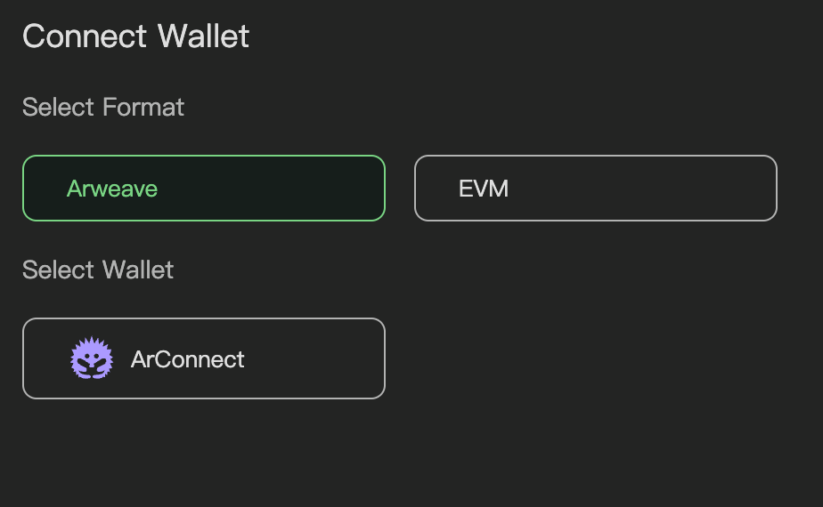  
Ethereum Wallet:
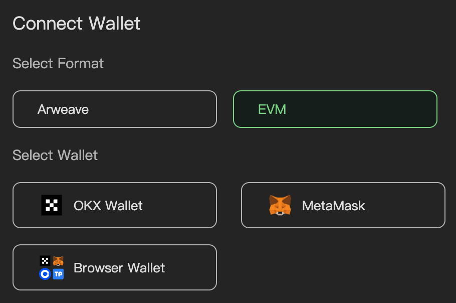   

## 拥有 AO 上的资产
将您的资产转移到 AO，生态中目前有两个第三方提供的跨链桥可以选择：
- EverVision 团队提供的 AOX Bridge: aox.arweave.dev
- Astro Bridge: bridge.astrousd.com

## 交易

### 市场单（Market Order）
#### 什么是市场单
市场单是指以当前市场价格立即成交的订单。交易者不设定价格，而是接受当前的买入或卖出价格。这种订单类型通常用于快速执行交易，但可能会受到价格影响，尤其是在流动性较低的市场中。这种功能在 FusionFi 协议的 AMM 交易模型中得到了有效应用。

#### Permaswap 的市场单功能
Permaswap 基于 FusionFi 协议的 AMM 交易模型实现市场单功能，为用户提供快速、高效的交易方式。    
具备以下特点：   
- **快速执行交易**：在 Permaswap 中，用户可以通过市场单快速执行交易。当用户希望立即完成交易时，市场单是最佳选择。无论是买入还是卖出，市场单都能确保用户以当前市场价格迅速交易，适合需要快速反应的交易策略。   
- **简化交易流程**：市场单的使用简化了交易流程。用户只需选择要交易的资产和数量，系统将自动以当前市场价格执行交易。这种简化的流程使得新手用户也能轻松上手，快速参与体验 DeFi 交易。    

*TODO: Permaswap 基于 FusionFi 协议的 Order Book 交易模型的市场单即将到来*

### 如何使用 Permaswap 市场单功能
点击导航栏上的 Swap 按钮，进入 Swap 产品界面，选择想要兑换的 token 即可完成实时兑换，如图所示：   

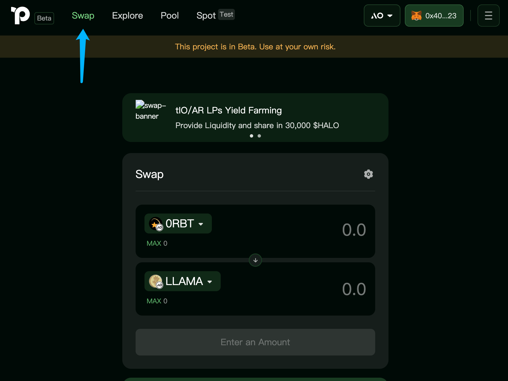    
#### 滑点  
滑点是兑换的预期价格与其实际成交价格的差额。   
- 用户可以自行设置滑点值，确定预期价格和成交执行价格之间的最大差值
- 如果滑点超过用户设置的值，则交易不会被执行
- 设置较高的滑点可能会对用户交易不利
- 设置较低的滑点可能会导致交易无法成交

Permaswap 默认滑点为 0.5%, 您可以通过以下方式修改默认值：   

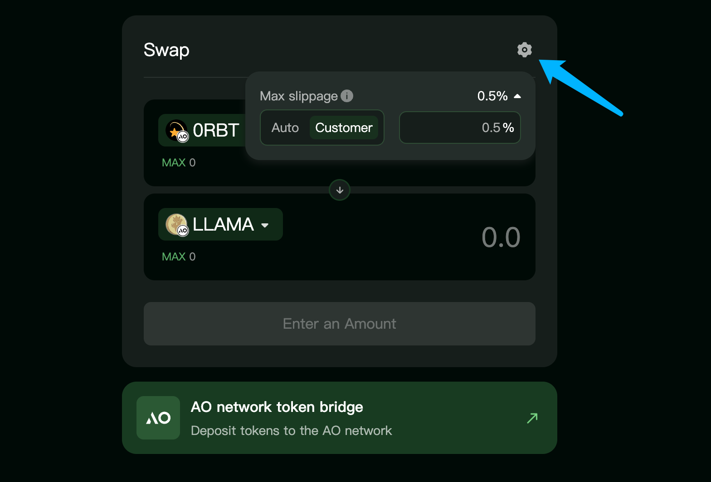   

#### Fees  
Permaswap 平台不会收取任何费用，每一笔兑换的具体费用取决于您与之交互指定的 AMM pool, 这些费用会在该 AMM pool 中自动分配给流动性提供者(LP).    

#### 兑换价格影响因素  
兑换价格的变化是指由于执行一笔交易而导致资产价格的变化。这在去中心化交易所（DEX）或者自动做市商（AMM）中尤为重要，因为它们的流动性模型会影响价格。   
简单来说，兑换价格主要受以下两个因素的影响：   
- 流动性：流动性是指市场中可用于交易的资产数量。在一个流动性池中，如果可用的资产数量较少，那么进行大额交易时，价格的变化会更加明显。   
- 交易规模：交易的大小与流动性池的规模相比越大，价格影响就越显著。例如，如果你想用大量的某种代币去兑换另一种代币，而这个流动池的规模相对较小，那么您的交易会导致池中两种代币的比例发生较大变化，从而直接影响价格。    

在 FusionFi 协议的 AMM 交易模型中，价格是通过一个公式来计算的，这个公式会根据池中两种代币的数量来决定它们的兑换比率。当您进行交易时，交易会改变池中代币的数量，进而影响价格。在兑换中一种代币数量会持续增加，另一种代币数量会减少，这样就会导致兑换价格上升。      

### 总结
Permaswap 的市场单功能为用户提供了快速、高效的交易方式。通过使用市场单，用户可以立即以当前市场价格完成交易，简化交易流程，并在市场波动中抓住机会。

--- 
### 限价单（Limit Order）
#### 什么是限价单
限价单是一种交易类型，允许用户在指定价格买入或者卖出资产。与市场单不同，限价单不会立即以当前市场价格成交，而是等待市场价格达到用户设定的限价时才会执行。
#### Permaswap 的限价单功能
Permaswap 基于 FusionFi 协议的 Order Book 模型实现限价单功能，为用户提供更加灵活、高效的交易方式。   
具备以下特点：   
- **提高交易灵活性**：在 Permaswap 中，用户可以通过限价单灵活地设定交易价格。这意味着用户可以在预期的价格水平上进行交易，而不必接受当前市场价格。这种灵活性使得用户能够更好地控制交易成本和风险。    
- **减少价格影响**：使用限价单可以有效减少交易对市场价格的影响。当用户以较大金额进行交易时，市场单可能会导致价格剧烈波动。而限价单则允许用户在特定价格下进行交易，从而降低了对市场的冲击。   
- **自动执行交易**：一旦市场价格达到用户设定的限价，限价单将自动执行。这种自动化功能使得用户无需时刻监控市场，能够在设定的价格水平上顺利完成交易。   

### 如何使用 Permaswap 限价单功能
点击导航栏上的 Spot 按钮，进入 Spot 产品界面，选择想要挂单的交易对，设置挂单价格，即可完成限价单的挂单：   

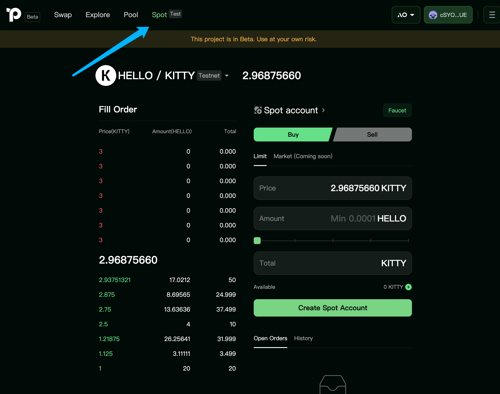

#### 创建 Spot Agent
初次使用限价单功能的用户点击 Create Spot Account 之后，Permaswap 自动帮助用户创建一个 Agent, 负责维护和执行用户挂单的所有限价单。
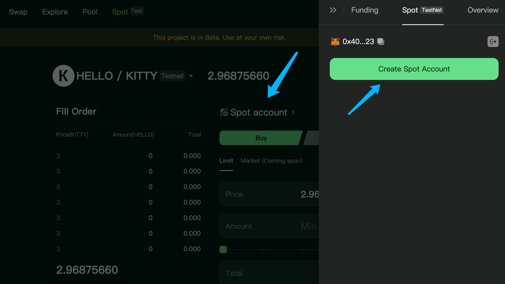
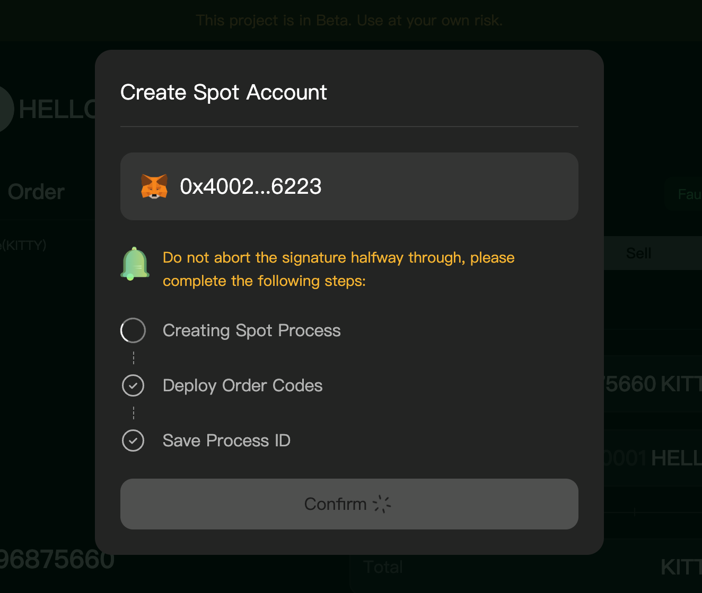   

Spot Agent 的作用：   
- 持续监控市场价格：
Agent 会实时监控市场价格的变化，确保用户的限价单能够在最佳时机执行。通过持续跟踪市场动态，Agent 能够及时捕捉到价格波动，为用户提供更好的交易机会。   
- 自动执行限价单： 
一旦市场价格达到用户设定的限价，Agent 将自动执行限价单交易。这种自动化功能使得用户无需时刻关注市场，能够在设定的价格水平上顺利完成交易，减少人为操作的延迟和错误。   
- 灵活设置交易条件： 
用户可以根据个人策略灵活设置 Agent 的交易条件，包括限价、交易数量，过期时间等。Agent 将根据这些条件进行监控和执行，帮助用户实现个性化的交易策略。
- 降低风险：
Agent 的使用可以降低交易风险。通过自动化监控和执行，用户可以避免因市场波动而错失交易机会，同时减少因手动操作带来的风险。    

#### Agent 充值
在使用限价单之前，Agent 需要持有足够的资产。所以您需要提前为 Agent 充值，操作如下：    
在 Transfer 页面, 选择需要挂单的资产类型并输入足够的数额进行充值

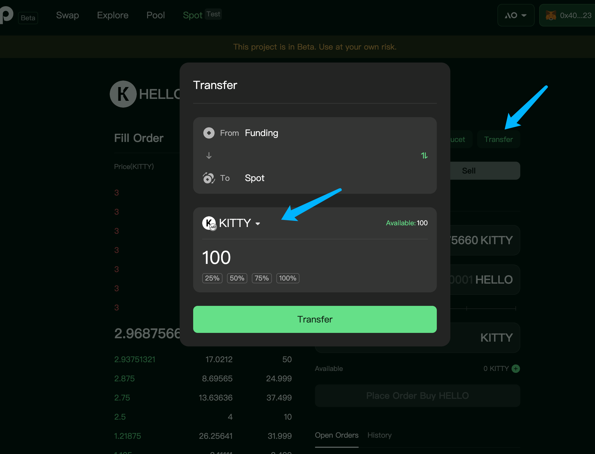

#### 挂单
挂单操作如下：   
选择挂单价格，挂单数量进行挂单即可   

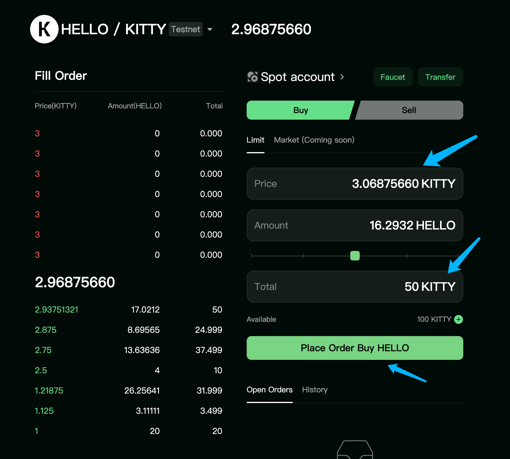   
挂单成功之后，就等待 Agent 自动接受吃单请求进行成交即可。   
吃单者可能是普通用户，可能是各种类型做市商，也可能是套利者机器人等等。FusionFi 协议中实现的 Order Book 是一个开放的订单薄系统，只要遵守协议规范，任何主体的挂单和吃单交易都会被执行，这使得 FusionFi 协议可以聚合 ao 网络上几乎所有的资产流动性。    
#### 吃单
用户可以直接在挂单池里面直接对指定的限价单进行吃单，对于 Permaswap 平台而言这只是其中一种最简单的吃单方式，也是用户最便捷的一种吃单方式。    
操作如下：   
1. 点击订单池中指定的订单   
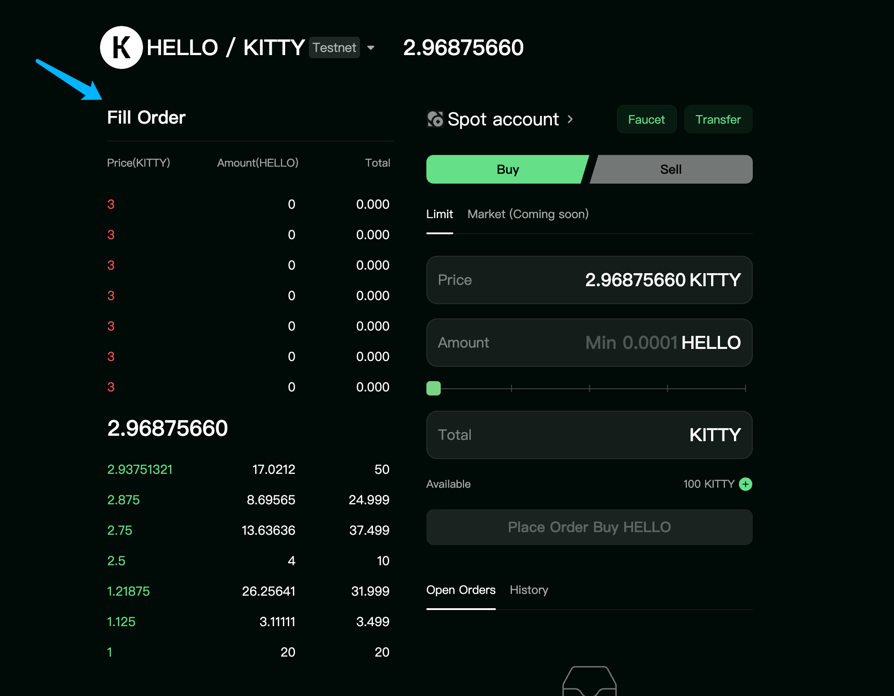    
2. 进行吃单交易   
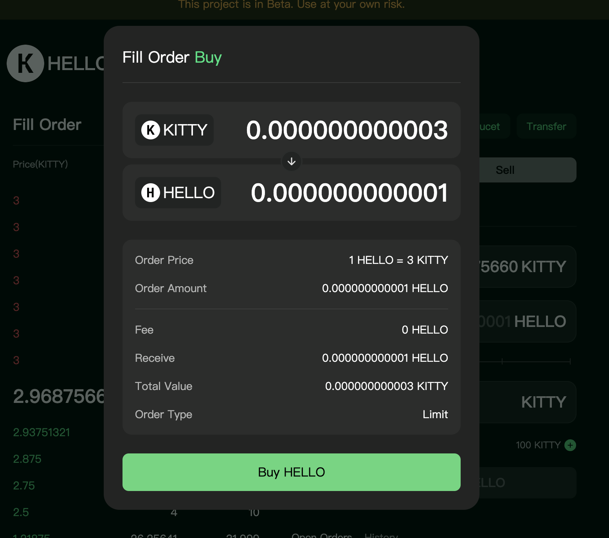

### 总结
Permaswap 基于 FusionFi 协议的 Order Book 交易模型实现限价单功能为用户提供了灵活、高效的交易方式。通过使用限价单，用户可以更好地控制交易成本，减少价格影响，并在市场中获得更大的交易机会。   

---

